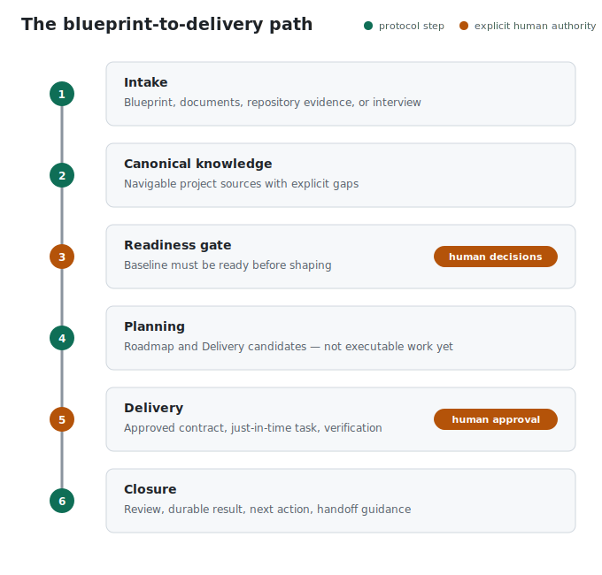

# Exorail

[](https://github.com/AntoSmartDev/Exorail/actions/workflows/verify.yml)

> **From blueprint to delivery: the operating system for supervised AI delivery.**

Exorail gives a software repository durable project memory, explicit authority boundaries, and a next action an LLM-powered coding agent can safely execute. It turns a blueprint, existing documentation, repository evidence, or a guided interview into a governed, resumable flow for supervised LLM-assisted software delivery that remains readable after the chat is gone.

It is not an IDE, a model, or a hosted agent service. It is a small, repository-native control plane for the work that happens around code.

**Status:** `v0.1.0` · Node.js LTS · Codex and Claude Code · one shared cursor with sequential handoff.

**In one sentence:** give Exorail the evidence you have; it helps turn it into a trustworthy project baseline, guides one approved slice of work to a verified result, and leaves the next agent a safe place to resume.

## Start in 60 seconds

1. Copy `.exorail/` and `AGENTS.md` into the target repository.
2. Tell a coding agent to run `.exorail/prompts/START_NEW_PROJECT_PROMPT.md`.
3. Give it the evidence you have: a blueprint, documents, an existing
   repository, or answers to its focused interview.

The agent produces canonical project knowledge, makes gaps and decisions
visible, establishes readiness, and proposes the first safe delivery slice. It
does not silently turn an incomplete brief into implementation authority.

Detailed copy and validation commands are [below](#start-in-a-target-repository).

## The value at a glance

| Starting point | What Exorail adds | What you keep afterwards |
| --- | --- | --- |
| A blueprint, brief, or product document | Canonical knowledge, explicit gaps, readiness checks, and decisions that need a human | A baseline another agent can understand without reconstructing the chat |
| An unfamiliar or existing repository | Evidence routing, trust posture, scoped recovery, and a safe first delivery slice | A visible record of what is observed, inferred, decided, or still unknown |
| A selected outcome | A just-in-time contract, proportionate task shape, verification plan, and approval boundary | Executable work only when its assumptions and authority are current |
| A changed assumption, session break, or LLM change | Drift detection, invalidation routing, checkpoint, compaction, or focused handoff guidance | A durable cursor with the next allowed action instead of a fragile chat recap |
| A completed change | Evidence-backed result, impact and limitation records, revalidation, and proposed next action | A defensible delivery trail—not merely a claim that the agent is “done” |

The promise is deliberately practical: **less remembering, less rediscovery, fewer silent leaps, and a clearer route from the evidence you start with to the delivery you can defend.**

## Why use it

AI agents are fast at changing files. They are much less reliable at preserving context, recognizing missing decisions, and knowing whether it is safe to continue. Exorail makes those responsibilities explicit and durable.

With Exorail, you get:

- **Durable memory instead of chat memory.** Product intent, architecture, engineering constraints, decisions, readiness, and the current position live in versioned repository artifacts.
- **A safe next step.** The cursor tells a new agent what to read, what is active, what is blocked, and what it may do next.
- **A guided path from ambiguity to delivery.** Start with a document, a codebase, or an interview; the workflow identifies gaps before it lets work become executable.
- **Just-in-time planning.** Keep future work as candidates, shape a Delivery Unit only when it is due, and materialize task detail only when its dependencies and contract are current.
- **Human control where it matters.** The agent can analyze, propose, and prepare; a human approves material contracts, protected Git actions, and closure decisions.
- **Continuity across sessions.** The workflow can recommend whether to continue, compact the current session, open a fresh session, or create a focused handoff.
- **Mechanical drift detection.** Included Node.js validators check cursor, readiness, contracts, task transitions, authority records, and text integrity before a mistake becomes hidden workflow debt.

You should not have to reconstruct project state from chat history or remember the next safe step by hand.

## The blueprint-to-delivery path



From intake to closure, the workflow makes the active transition visible. It
creates knowledge before planning, requires explicit human authority before
protected work, and records an evidence-backed result before moving on.

The workflow does not force a full task tree on day one. It first establishes a project frame and one sufficiently defined delivery slice. It then advances only when evidence, dependencies, and the required human authority are in place.

This is why Exorail is useful beyond the first plan: each transition leaves a durable state that can be checked, resumed, challenged, or handed to a fresh agent without relying on the original conversation.

## What Exorail does, and what remains yours

| Exorail helps the agent do | A human still decides |
| --- | --- |
| Organize evidence into canonical project sources | Product direction, scope, and unresolved trade-offs |
| Detect missing readiness evidence and route setup recovery | Whether a proposed contract is approved |
| Preserve the current Delivery Unit, task, result, and next action | Whether a material change is acceptable |
| Propose branch, commit, merge, pull-request, or deferral actions | Every protected Git mutation and integration action |
| Revalidate downstream work when a result changes assumptions | Closure of a Delivery Unit, milestone, scope, or project vision |
| Recommend continue, compact, new session, or handoff | Whether to accept the recommendation or change priorities |
| Report deterministic workflow and text-integrity findings | Semantic correctness, architecture, builds, tests, and review judgment |

Exorail is deliberately supervisory: it reduces forgotten steps without pretending that a validator or an agent can replace engineering judgment.

## Built for the realities of AI-assisted delivery

The terms below are not a collection of marketing labels. They name the
operational problems Exorail addresses in a repository, with durable artifacts
and checks rather than relying on a model's private chat history.

| Recognizable theme | What it means in Exorail |
| --- | --- |
| **Durable project memory** | A versioned, inspectable “second brain” for the project: evidence, decisions, readiness, contracts, results, and the current cursor live with the code. It is project memory, not an opaque personal memory owned by one model or vendor. |
| **Context engineering** | The active work names the smallest relevant canonical reads, reasoning posture, and context-pressure response for LLM coding agents. This helps avoid both blind execution and repeatedly loading an entire project into every chat. |
| **Model portability** | A focused switch prompt lets an incoming supported LLM coding agent reconstruct the required state from the repository. You can move from Codex to Claude Code, or back, without restarting the delivery from a fragile chat recap. |
| **Controlled autonomy** | The agent can investigate, propose, prepare, and validate within explicit boundaries. It cannot treat a candidate as executable work, invent human approval, or silently resolve a material conflict. |
| **Human-in-the-loop governance** | Product direction, contracts, protected Git actions, exceptions, residual risk, and closure remain deliberate human decisions with durable rationale. |
| **Deterministic guardrails** | Node.js validators mechanically check cursor state, contracts, task transitions, authority records, paths, and text integrity. They expose workflow drift early; they do not pretend to replace engineering review. |
| **Evidence-backed delivery** | A delivery result records acceptance, checks actually run, limitations, impact, and revalidation. “Done” becomes evidence another engineer or agent can inspect. |
| **Resumable work and recovery** | A new session, a context compaction, a model change, a changed assumption, or a stale baseline has an explicit route: checkpoint, handoff, challenge, invalidation, or targeted recovery. |
| **Team-ready direction** | Today Exorail governs one shared cursor and sequential handoff honestly. Its next evolution is explicit shared-cursor and partitioned-work orchestration for teams—not an unearned claim in v0.1.0. |

This makes Exorail a control plane for agentic software delivery: durable
project memory plus explicit authority and a mechanically checked next step.

## Operational guidance from intake to delivery

Exorail does not just leave a plan in the repository. It continuously tells an
agent what kind of work it is doing, what evidence it needs, and when it should
stop or change its approach.

| Moment | Guidance kept in the repository | Why it helps |
| --- | --- | --- |
| **Intake** | Classifies a blueprint, existing documents, codebase evidence, or interview answers as canonical, reference-only, provisional, or missing | Prevents an agent from treating a plausible assumption as established fact |
| **Knowledge routing** | Records the smallest required reads for the active work instead of asking every agent to reload the whole project | Keeps attention on relevant evidence and avoids a broad, diluted context window |
| **Readiness** | Separates project-frame readiness, slice readiness, baseline readiness, and delivery readiness | Stops implementation before missing decisions, structure, or verification make it unsafe |
| **Reasoning calibration** | A Delivery Contract or task records `low`, `medium`, or `deep` reasoning appropriate to the work | Helps the operator calibrate the reasoning effort for the task; Exorail does not choose an LLM model for you |
| **Candidate shaping** | Holds future work as non-executable candidates, then exposes contract assumptions, scope, dependencies, acceptance, and verification before approval | Avoids turning a vague roadmap row into unreviewed implementation |
| **Task transitions** | Rechecks contract revision, dependency results, repository changes, decisions, and assumptions before the next task materializes | Detects stale downstream work instead of letting it inherit invalid context |
| **Material changes** | Routes a mismatch to clarification, contract revision, task reshaping, a blocker, or setup invalidation | Makes disagreement and changed evidence visible rather than silently patching around them |
| **Git actions** | Proposes a branch, commit, merge, pull request, tag, or deferral with scope and rationale | Preserves human approval for every protected mutation; no Git action is implied by an agent recommendation |
| **Session pressure** | Records whether the next step should continue, compact, open a new session, or hand off | Keeps durable state in the repository instead of carrying an ever-larger chat forward |
| **LLM change** | Provides a focused switch prompt and durable required reads for the next agent | Lets you move, for example, from Codex to Claude Code without reconstructing project state from memory |
| **Closure** | Records acceptance, checks actually run, evidence references, limitations, impact, revalidation, and the next selection | Replaces an uninspectable “done” with an auditable result and a safe recovery point |

### Context is a resource, not a dump

For each task, the workflow names the relevant canonical sources and the
expected reasoning level. It can recommend a fresh session when durable state
is sufficient, or `compact_then_continue` when immediate continuity still has
material value. This reduces needless re-reading and avoids carrying unrelated
or stale conversation into the next decision.

When a small amount of temporary context still matters, Exorail asks for a
short chat summary or a focused handoff. These are temporary bridges, not a
second source of truth: the contract, cursor, decisions, results, and required
reads remain authoritative. That separation can reduce token waste and context
dilution without pretending that a new session alone guarantees correctness.

### Switch coding agents without restarting the project

Need a different coding agent for the next phase? Run
`.exorail/prompts/SWITCH_LLM_PROMPT.md` in the target repository. It directs the
incoming agent to inspect the durable state, required reads, current cursor,
and outstanding authority before continuing. In practical terms, you can move
from Codex to Claude Code—or back again—with a focused prompt and continue the
same governed delivery instead of rebuilding the project from chat history.

The new agent still performs its required reads and validations; Exorail does
not claim that one model inherits another model’s private conversation. What it
preserves is the project state needed to resume safely.

### A realistic recovery at 70% context

An agent reaches 70% reliable context usage while completing a task. Exorail
recommends compaction and a durable checkpoint before the agent expands its
working set. The checkpoint records the current cursor, required reads,
contract revision, decisions, results, and the next allowed action. You can
then open a fresh Codex or Claude Code session, use the handoff or switch
prompt, and have the incoming agent validate that state before continuing.

The useful outcome is not an attempt to preserve every chat message. It is a
controlled resumption from the project facts that matter, with less token waste
and less risk that stale conversational detail drives the next change.

When the active client exposes reliable context-usage telemetry, the workflow
uses graduated guidance:

| Context used | Guidance |
| --- | --- |
| Below 50% | Continue without a context prompt. |
| At or above 50% | Offer compaction once and state whether preserving the current chat still has material value. |
| At or above 70% | Recommend compaction and prepare a durable checkpoint before broadening context further. |
| At or above 85% | Avoid optional context expansion; strongly recommend compaction or a controlled handoff. |

If an operator declines, the workflow does not repeat the same prompt every
turn. It raises the question again only at a higher band, before a
context-intensive phase, or when the risk of losing material state changes.
When telemetry is unavailable, it describes context pressure as an estimate
rather than inventing a percentage.

### It also knows when not to proceed

The workflow can pause active work when a contract assumption conflicts with
repository evidence, when a required source is stale, when a planned task is
not yet independently verifiable, or when a human decision is still missing.
It may recommend a simpler Light Delivery Unit, a Structured unit with
explicit decomposition, a contract challenge, incremental setup recovery, or a
completion-gap review. The point is not to add ceremony; it is to make the
smallest next safe move explicit.

## Fine-grained safeguards that change day-to-day work

The value is in the small controls that prevent an agent from making a locally
plausible but globally unsafe move.

- **Evidence has a trust posture.** During greenfield, brownfield, or mixed
  work, Exorail distinguishes observed facts, supported inferences, user
  decisions, legacy evidence, contradictions, and unresolved gaps. Source code
  proves current behavior; it does not silently become desired architecture.
- **Authority is proportionate.** A small contract can use a concise decision
  brief; a material revision, process exception, residual risk, or structured
  closure requires a fuller decision record. Silence, a chat reaction, and an
  agent recommendation never count as approval.
- **Work shape follows risk.** A Light Delivery Unit is for one atomic outcome
  and one verification boundary. A Structured unit is used when dependencies,
  boundaries, risk, session length, or shared acceptance justify decomposition.
  A unit can be promoted from Light to Structured when evidence makes that
  safer.
- **Ownership stays optional and explicit.** Modules are introduced only when a
  stable bounded context truly owns the work. Cross-cutting work remains at the
  root with affected boundaries recorded, rather than being forced into an
  artificial hierarchy.
- **Verification is planned, then evidenced.** The workflow asks what was
  actually run, where later readers can inspect it, which layers were omitted,
  and what limitations remain. A green validator is not substituted for tests,
  review, or product acceptance.
- **Security review is triggered by change, not ceremony.** A changed trust
  boundary, sensitive-data path, authorization rule, untrusted input, or
  infrastructure exposure requires proportionate evidence and residual-risk
  recording.
- **Changed assumptions have a route.** A Contract Challenge captures an
  infeasible, unsafe, inconsistent, or no-longer-atomic approved approach. It
  pauses affected work, exposes the smallest correction and alternatives, and
  requires a human resolution before protected work resumes.
- **Baseline invalidation is scoped.** Structural evidence can invalidate setup
  without discarding the whole project state. The workflow records what is
  affected, pauses only related work, and routes targeted recovery.
- **Repeated failure changes the method.** After the same blocker recurs, the
  agent preserves evidence, expands the required context, and must choose a
  materially different plan rather than retrying the same hypothesis.
- **Closure has levels.** A task result is not automatically a completed
  Delivery Unit, milestone, bounded context, current scope, or project vision.
  Empty queues trigger a completion-gap review instead of a false declaration
  of completion.
- **Parallel work has an honest boundary.** One shared cursor is sequential.
  Real parallel work must first be partitioned by branch, workflow root, or
  independently scoped Delivery Unit, then integrated through normal review.
## What happens during delivery

### 1. Establish a trustworthy baseline

The agent reads the available evidence, identifies what is authoritative and what is only provisional, and turns the result into navigable canonical sources. If important knowledge is missing, it asks focused questions instead of silently inventing a plan.

### 2. Decide what is ready

Readiness separates a project frame from an executable slice. A roadmap can contain future candidates, but a candidate does not grant implementation authority. This prevents a plausible-looking plan from quietly becoming work.

### 3. Shape only the work that is due

When a candidate is selected, Exorail guides the agent to draft a Delivery Contract, surface assumptions and verification, and request approval. The contract becomes executable only after the recorded human decision. Complex outcomes can then receive task-level detail just in time.

### 4. Keep work recoverable while it changes

Before a task proceeds, the workflow checks its contract revision, dependencies, repository changes, decisions, and assumptions. If something material changes, it routes the work to clarification, revision, reshaping, or a recorded blocker instead of allowing silent drift.

### 5. Close with evidence, not a vague “done”

A result records acceptance, executed checks, limitations, impact, and what must be reconsidered next. Exorail then proposes the appropriate Git action and session transition; it does not perform protected actions without explicit approval.

## Why it is more than spec → plan → tasks

A specification is necessary, but a continuing project also needs to answer:

- Is the current evidence sufficient to begin?
- Which decision is missing, and who can make it?
- Is this candidate ready to become a contract?
- Did a previous result invalidate the next task?
- What must a new agent read before it acts?
- Should the current context continue, compact, or hand off?

Exorail keeps those answers in the repository and checks their mechanical consistency. A spec-first flow is excellent at creating a starting plan; Exorail carries that plan through readiness, authority, execution, changing evidence, verification, and resumable delivery. That is the difference between a one-time planning sequence and a control surface for continuing AI-assisted delivery.

## Who it is for

Exorail is for structured, continuing software work where durable context, verification, handoff, and explicit authority justify a small process overhead. It is especially useful when an agent returns after a session break, the repository is unfamiliar, requirements arrive as documents, or a change affects future work.

It is not intended for throwaway scripts, brief experiments, or trivial one-off edits. Today it governs one shared delivery cursor with sequential handoff; team-scale parallel coordination is a future extension, not a claim of the current release.

## What is stored in the repository

| Artifact | Purpose |
| --- | --- |
| `AGENTS.md` | Fail-closed entrypoint for coding agents |
| `.exorail/PROJECT_READINESS.md` | What is sufficient, missing, or invalidated |
| `.exorail/KNOWLEDGE_INDEX.md` | Where durable project knowledge lives and what to read |
| `.exorail/DECISIONS.md` | Human authority, rationale, and durable consequences |
| `.exorail/CURRENT_CURSOR.md` | Current state, required reads, and next allowed action |
| Delivery Contracts, tasks, and results | Approved intent, execution evidence, impact, and recovery path |
| Node.js validators | Deterministic checks for state, authority, paths, and text integrity |

## Start in a target repository

Copy `.exorail/` and `AGENTS.md` into the target repository root. They are required. `CLAUDE.md` is optional and only needed when the target uses Claude Code.

The installed workflow does not require PowerShell. The commands below are only copy alternatives.

### Bash

```bash
target=/path/to/target-repository
cp -R .exorail "$target/.exorail"
cp AGENTS.md "$target/AGENTS.md"
# Optional for Claude Code:
# cp CLAUDE.md "$target/CLAUDE.md"
```

### PowerShell

```powershell
$target = 'C:\path\to\target-repository'
Copy-Item .exorail (Join-Path $target '.exorail') -Recurse
Copy-Item AGENTS.md (Join-Path $target 'AGENTS.md')
# Optional for Claude Code:
# Copy-Item CLAUDE.md (Join-Path $target 'CLAUDE.md')
```

Do not overwrite existing root instruction files or an existing workflow container without reviewing and deliberately merging the durable rules.

Then ask the chosen coding agent:

> Read and execute `.exorail/prompts/START_NEW_PROJECT_PROMPT.md`. Configure this repository from the available evidence, identify blocking gaps, and propose the first safe delivery slice.

## Validate

Use a maintained Node.js LTS release from the target repository root:

```bash
node .exorail/tools/validate-workflow.mjs
node .exorail/tools/validate-text-files.mjs AGENTS.md .exorail/AGENTS.md
# Include CLAUDE.md only when you copied the optional bridge:
# node .exorail/tools/validate-text-files.mjs AGENTS.md CLAUDE.md .exorail/AGENTS.md
```

The validators check mechanical consistency and text integrity. They do not replace product review, semantic architecture review, builds, tests, security analysis, or human decisions. GitHub Actions Verify has completed for `v0.1.0` on Windows, Linux, and macOS runners; it validates these Node.js checks only and is not a general platform-support claim.

## Version and license

Product version: `v0.1.0`.

Workflow schema: `0.5` in `.exorail/WORKFLOW_CONFIG.md`. Product releases and workflow-schema compatibility are separate concerns.

Licensed under the [MIT License](LICENSE).
