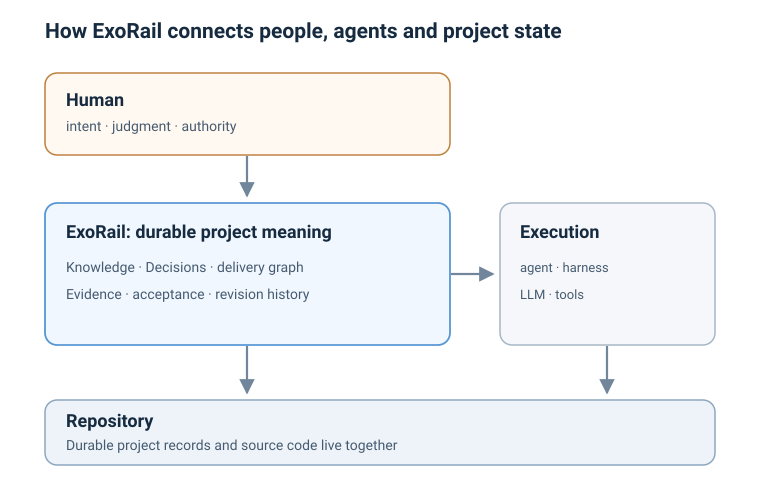
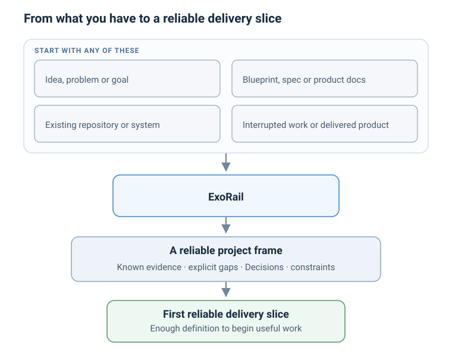
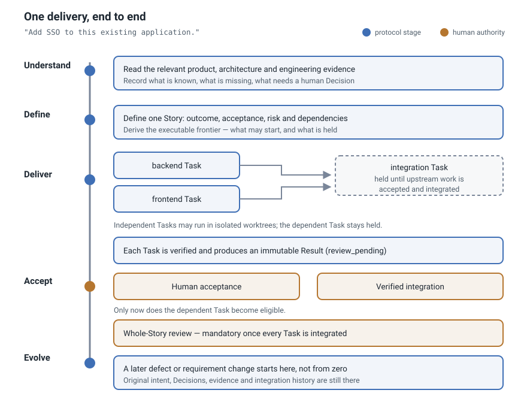
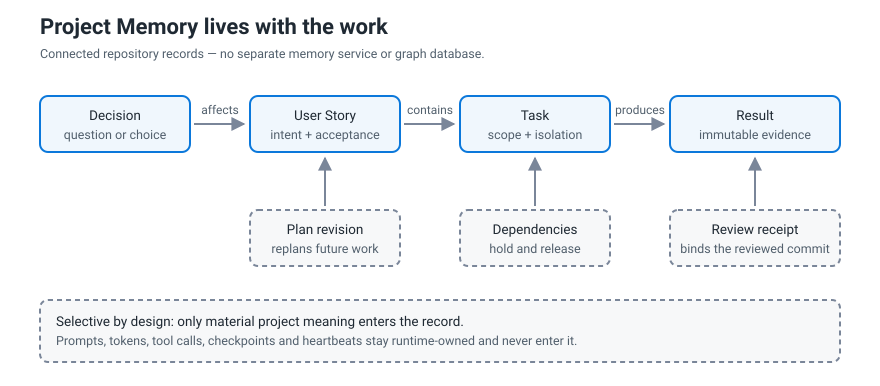
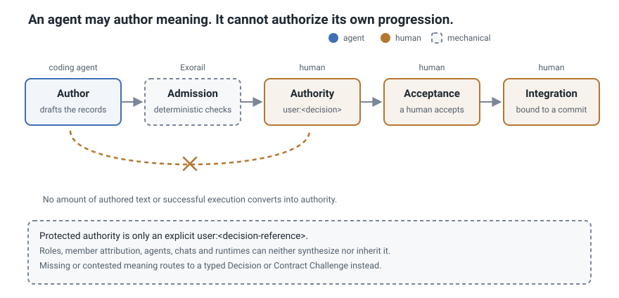
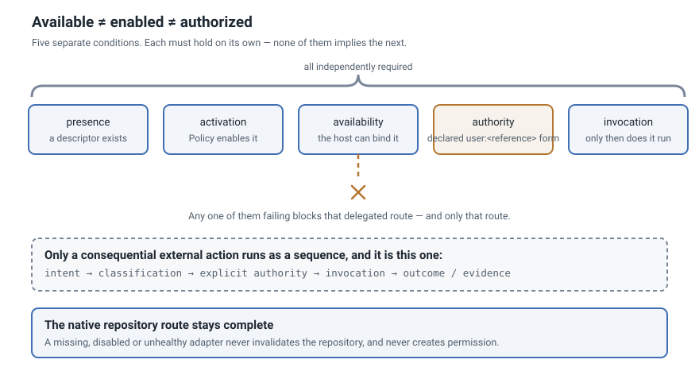

<div align="center">

<picture>
  <source media="(prefers-color-scheme: dark)" srcset="assets/exorail-header-dark.svg">
  
</picture>

# ExoRail — Human-AI Software Delivery Control Plane

[](https://github.com/AntoSmartDev/Exorail/actions/workflows/verify.yml)

</div>

---

## An Agentic Development Platform for continuing software projects

**ExoRail is a repository-native software delivery system for projects built with coding agents.** It guides work across the software development life cycle (SDLC) — **Understand → Define → Deliver → Evolve** — from progressive project understanding and definition through planning, executable Tasks, Results, verification, review, human acceptance and Git integration, then resumption, replanning and continued evolution. Project meaning, decisions, evidence and history remain durable as humans, agents and tools change.

Architecturally, it is a **repository-native Project Control Plane**. Operationally, it enables **Human-AI Project Orchestration**: guided definition, durable Project Memory, governed execution, verification, acceptance, integration, replanning, recovery and continued evolution.

**Human-in-the-project** is the thesis behind this model: human judgment and authority remain part of the durable project lifecycle.

**Agents and harnesses execute work. ExoRail keeps the project coherent around that work.**

ExoRail coordinates the project around coding agents and optional multi-agent frameworks; it does not replace them or require a hosted agent-fleet control plane.

**New here?** [Start in three steps](#start-in-three-steps). If ExoRail blocks progression, use [the finding reference](.exorail/method/FINDINGS.md) to understand the correction and recovery route.

**Windows prerequisite:** before creating canonical records, enable `git config core.longpaths true`. [Why this matters](#install-the-clean-break).

The native route requires no server, database, broker, hosted control plane, external orchestrator or ALM platform:

```text
your repository + ExoRail + one capable LLM-powered coding agent
```

## Is ExoRail solving your problem?

AI-assisted delivery can work locally while the project loses continuity around it. Does any of this sound familiar?

- Every new AI session needs the project explained again.
- Important decisions, constraints and trade-offs disappear into chat history.
- You have an idea, request, brief or existing codebase, but cannot tell which facts, constraints, acceptance criteria or Decisions must become explicit before the next slice is safe to execute.
- Missing specification turns into agent assumptions instead of visible gaps, focused questions and reviewable choices.
- Agents can produce code, but nobody can reliably say what may happen next.
- Independent work can fan out, but safely converging it becomes another coordination problem.
- “The agent finished” is too easily confused with “the project accepted the result.”
- Changing agent, harness, model or provider means rebuilding context and assumptions.
- Human-in-the-loop provides checkpoints, but human judgment and authority are not explicit across the whole project lifecycle.
- The repository, tools, agents, CI and workflows exist, but no durable project-wide layer keeps their meaning coherent over time.

**If these problems feel familiar, you are already dealing with the problem ExoRail was built to solve.** It keeps the project—not a session, provider or runtime—as the durable centre of delivery.

ExoRail does not require perfect up-front specification. It helps turn available evidence into a smallest reliable project frame: known facts, explicit gaps, constraints, Decisions and one sufficiently defined delivery slice.

Six terms place ExoRail precisely:

| Positioning layer | Meaning |
| --- | --- |
| **Agentic Development Platform** | Market category: software-development platforms in which AI agents participate materially in the engineering lifecycle. |
| **Human-AI Software Delivery Control Plane** | The product category: a layer coordinating people, AI execution, tools, evidence and continuity across delivery. |
| **Repository-native Project Control Plane** | The architectural role: durable project meaning lives with the work, rather than in a particular agent session, provider or hosted service. |
| **Human-AI Project Orchestration** | The operating model: coordinating intent, reasoning, execution, deterministic rules, verification and human authority. |
| **Software Development Life Cycle (SDLC)** | The lifecycle scope: project continuity across Understand → Define → Deliver → Evolve, connecting development, delivery and later change. |
| **Spec-Driven Delivery Governance (SDDG)** | The assurance discipline: deterministic safeguards and explicit evidence/authority boundaries keep the lifecycle reliable. |



Governance is how this orchestration stays reliable, not the product's sole definition. ExoRail is grounded in **Spec-Driven Development (SDD)** and extends it through **Spec-Driven Delivery Governance (SDDG)**: AI can reason and execute; deterministic rules protect known invariants; humans retain consequential judgment and authority.

## Start with what you actually have

**You do not need to arrive with a finished specification.** ExoRail helps establish the smallest reliable project frame needed to plan and deliver the next useful slice.



| Starting point | What the current method makes explicit |
| --- | --- |
| **Greenfield** — an idea, problem or objective | Intent, constraints, material gaps and Decisions before they silently become implementation assumptions. |
| **Blueprint / specification** — briefs, requirements, product or architecture documents | Evidenced project knowledge, unresolved gaps and a connection from the stated outcome to a reviewable Story. |
| **Brownfield** — an existing repository or system | Observed current reality, declared future intent and relevant boundaries, without inventing historical delivery records. |
| **Ongoing or delivered ExoRail-managed project** — interrupted work or a product evolving after delivery | The current project position, preserved Results, receipts and evidence, and a route to resume, repair or evolve it. A newly adopted existing product follows the brownfield route above instead. |

This is focused, progressive setup—not a claim of a fully autonomous discovery engine, complete semantic sufficiency analysis or automatic risk profiling. The method makes uncertainty visible, routes consequential ambiguity to Decisions or Challenges, and defines only the next slice to the detail it can support.

### What ExoRail changes

**Start from incomplete reality without inventing what is missing.** An idea, partial documentation, a brownfield repository or an already delivered system is enough to begin. ExoRail makes known facts, inferences, gaps and Decisions explicit, then defines only the next delivery slice to the level at which it can safely be executed. [How progressive definition works](#start-with-what-you-actually-have)

**A Project Memory built for people and AI agents.** Material knowledge, Decisions, evidence, Results, revisions and delivery history remain durable and navigable in the repository, rather than being left in a particular person's or agent's chat context. This is operational memory: the same state that explains the project also helps determine what may safely happen next. [How ExoRail Project Memory works](#exorail-project-memory)

**See the project across time, and give each actor the context that matters.** Past evidence and Decisions, present blockers and active work, and planned or currently admissible next work can be reconstructed from durable state. Required reads route a new session to the smallest relevant context instead of treating accumulated chat history as project truth. [How temporal navigation works](#see-the-project-across-time) · [How context engineering works](#context-is-a-resource-not-a-dump)

**Independent work can fan out; delivery still converges under control.** Tasks may be carried by separate people, agents, isolated worktrees or optional runtimes when declared dependencies and isolation allow it. The executable frontier shows what may start and why other work is held; verification, human acceptance and integration determine where dependent work must converge. [How the governed delivery graph works](#governed-delivery-graph)

**Agents can author work, but cannot legitimize their own progression.** Deterministic admission and explicit human authority stay separate from AI-authored meaning. Ambiguity becomes a Decision or Contract Challenge with evidence, impact and options—not an assumption that silently becomes code. [How authority and ambiguity are governed](#authority-decisions-and-non-self-legitimizing-agents)

**Execution is evidence, not delivery completion.** Result evidence, verification, review preparation, human acceptance, verified integration and whole-Story outcome are distinct. A review also remains bound to the exact change that was inspected. [How evidence-backed completion works](#verification-and-review-scale-with-the-change)

**The project can resume, replan and evolve without losing its history.** Material change affects future work through revisions and scoped recovery; it does not rewrite completed Results or receipts. [How ExoRail survives interruption and change](#resumability-replan-and-targeted-recovery)

**Define only what can be grounded now, and catch drift before it authorizes work.** A reviewable Story needs a known outcome and acceptance, not a fully detailed future backlog. Structural, lifecycle, dependency, revision and review-identity checks expose stale or invalid state before the next step relies on it. [How the lifecycle works](#the-lifecycle-exorail-keeps-operational) · [How safeguards work](#a-few-safeguards-that-matter-every-day)

**A delivery loop has a safe exit, not an endless retry.** Controlled attempts are bounded, a terminal candidate closes its attempt slice, and a material replan preserves that slice before routing new work through a current-revision successor Task. [How bounded execution loops recover safely](#controlled-execution-loops-and-successor-tasks)

**Professional from the first repository. Progressive as delivery needs grow.** The native route already preserves durable meaning, evidence and authority boundaries. Integrations and automation can be added later without replacing the project model or making heavyweight infrastructure a prerequisite. [How Professional Progressive adoption works](#professional-progressive) · [How adapters add capability without moving authority](#extend-exorail-with-adapters)

## Choose the depth you need

This README is intentionally layered rather than split into separate “beginner” and “expert” versions.

- **New to ExoRail?** Read *What ExoRail changes*, the [delivery example](#exorail-in-one-delivery-example) and [Start in three steps](#start-in-three-steps). That is enough to understand the product and try it.
- **Evaluating ExoRail for professional use?** Continue through team delivery, verification, SDDG governance, safeguards, portability and the repository architecture.

The same product is being described at increasing depth: **value → example → mechanism → architecture → reference**.

## ExoRail in one delivery example

Suppose the request is:

> **“Add single sign-on (SSO) to this existing application.”**

ExoRail first distinguishes observed evidence from gaps and questions requiring a human Decision, then defines one reviewable Story and derives which Tasks may start. Backend and frontend work can proceed independently in their own Task worktrees, while their dependent integration Task waits until the required upstream integration and review-boundary conditions are satisfied. With Task-boundary review, shown below, upstream human acceptance precedes integration; Story-boundary review batches human acceptance at the Story while retaining Task evidence and integration gates. A later change begins with the original intent, Decisions, evidence and delivery history still available; an agent finishing a Task never stands in for accepted delivery.



## Start in three steps

1. Copy `.exorail/` and `AGENTS.md` into the target repository.
2. Tell a capable coding agent to run `.exorail/prompts/START_NEW_PROJECT_PROMPT.md`.
3. Give it what you actually have: an idea, brief, documents, existing code, or answers to its focused interview.

The agent establishes the **smallest reliable project frame**, makes gaps and Decisions visible, and proposes the first safe delivery slice.

In ExoRail, an assumption does not silently become implementation authority.

Detailed copy and validation commands are [below](#install-in-a-target-repository).

## Everyday requests to the coding agent

Write these requests in your coding-agent conversation after installing ExoRail. The agent follows the existing method or invokes the relevant native tool.

| Request | When to use it | What the agent does |
| --- | --- | --- |
| `Exorail: help` | Find the available entrypoints | Lists these requests and points to the native tool reference. |
| `Exorail: start` | Begin from an idea, documents or an existing repository | Guides setup, inspects available knowledge and readiness, makes gaps explicit and proposes the first safe delivery slice. |
| `Exorail: status` | Understand the current project position | Reads relevant canonical records and fresh views; distinguishes declared state, mechanically verified findings and inference. |
| `Exorail: resume` | Continue interrupted work | Reconstructs the relevant context from repository state and fresh resumption views; no prior pause command is required. |
| `Exorail: validate` | Check workflow records | Runs the workflow validator and reports its actual exit code and findings; a pass does not certify product completeness. |
| `Exorail: review` | Prepare a Task or Story for review | Uses the subject and real Git base/head identities to derive readiness and review orientation; acceptance remains a separate human decision. |
| `Exorail: explain AG606` | Understand a finding or blocker | Reads the finding reference and cited evidence, explains the documented correction and identifies unverified assumptions. Replace `AG606` with the finding you received. |
| `Exorail: team` | Inspect declared project members and attribution | Shows the read-only Team View; membership and local identity do not grant authority. |
| `Exorail: projections check` | Check whether generated views are current | Runs the projection freshness check and reports stale views or invalid inputs; it does not refresh or rewrite them. |
| `Exorail: switch` | Hand work to another agent, model or harness | Follows the handoff prompt using durable project state; it does not transfer a provider session or uncommitted work automatically. |

These are natural-language requests, not shell commands, slash commands or an installed Skill. The [installed intent map](.exorail/AGENTS.md#manual-intent-shortcuts) owns their routes and limits. None performs acceptance, integration, projection refresh or publication. Unknown intentions or missing required sources are reported; resume/switch with non-empty planning stop on absent or stale resumption projections and offer regeneration as a separate action. The native workflow also works without these shortcuts.

## What setup produces from each starting point

The entry model above describes what you can bring. Setup turns that evidence into durable, repository-native project state and the next safe route.

| Starting point | Setup makes durable | It then supports |
| --- | --- | --- |
| **Idea or incomplete brief** | Intent, explicit gaps, constraints, readiness and Decisions in the project frame | A focused question or the smallest justified delivery slice |
| **Specification or product documents** | Routed project knowledge, acceptance and constraints | A reviewable Story when the outcome and acceptance are known |
| **Existing repository / brownfield system** | Observed current reality, declared future intent and relevant boundaries | New deliberate work without inventing historical delivery records |
| **Interrupted or delivered ExoRail-managed project** | Current position and existing Results, receipts, evidence and revision history | Resumption, repair or later evolution from its durable state |

## The lifecycle ExoRail keeps operational

SDLC describes the breadth of this lifecycle; the four phases below remain ExoRail's operating model. Planning, execution, verification, review, acceptance and integration make Deliver operational. Resumption and replanning keep work coherent across interruption and change.

```text
Understand → Define → Deliver → Evolve
```

| Phase | ExoRail makes operational | Human responsibility remains |
| --- | --- | --- |
| **Understand** | Evidence classification, focused discovery, knowledge routing, gaps, readiness and Decisions | Product direction and unresolved trade-offs |
| **Define** | Outcome, acceptance, risk, dependencies, Policy and a reviewable delivery slice | Whether the proposed slice is valuable and ready to authorize |
| **Deliver** | Executable frontier, scoped work, verification, immutable Results, receipts, review readiness and integration state | Acceptance, consequential authority and whole-Story outcome |
| **Evolve** | Material change, plan revision, supersession, resumption, fixes and future work | Whether to change scope, accept risk or close an outcome |

During Define, product intent, architectural constraints, engineering and verification expectations, and the knowledge needed for the work become an explicit project frame. ExoRail keeps material gaps and Decisions visible, then defines a Story with acceptance criteria and only the Task detail needed for the next safe delivery slice.

The canonical work path is `Epic → Feature → User Story → Task`. A Milestone collects Stories and a Context tags work; neither is a parent. Definition remains progressive: establish a reliable frame, define a useful slice, execute, learn, then refine or replan.

Progressive does not mean vague. ExoRail keeps the future visible at the level that is currently justified, while requiring sufficient non-generic detail only for the work that is about to become executable. This preserves direction without turning speculative future decomposition into false certainty.

## Team development without a shared cursor

ExoRail is designed so several people or agents can work from the same repository without turning one developer's session position into global project state.

The key separation is:

```text
shared repository
→ project state, work attribution, dependencies, Results, Decisions and receipts

local machine / worktree / session
→ current developer identity and disposable working position
```

A developer therefore does **not** commit a personal live cursor such as `"I am currently on Task X"` for everybody else to inherit. Local identity lives outside shared Git state, while the repository keeps the durable facts that every developer must agree on. After a pull, branch switch, worktree switch or machine restart, shared project state can be reconstructed without overwriting another person's current position.

### How work is divided

| Mechanism | What it gives the team |
| --- | --- |
| **Provider-neutral team attribution** | Stable project-member references keep ownership, assignment and historical completion independent from GitHub, Azure DevOps, Jira or another provider. |
| **Owner, assignee and completed-by remain different** | Responsibility for an outcome, the person currently carrying it forward, and the person who actually completed recorded work are not collapsed into one field. |
| **Team View** | A generated team-wide view shows active/planned work by member without becoming another source of truth. |
| **Local identity** | The shipped `.exorail/local/.gitignore` ignores `.exorail/local/identity.json`, so each clone or machine can identify its current project member without changing shared repository state. |
| **Feature / Story decomposition** | Work is divided into coherent delivery slices instead of a global queue that every developer edits blindly. |
| **Context and bounded-context knowledge** | Cross-cutting Contexts tag relevant work, while bounded-context and context-boundary knowledge describe domain/architecture boundaries that help people and agents understand where a change belongs. |

A `Context` is deliberately **not** another parent in the work hierarchy. It is a cross-cutting classification. Likewise, bounded-context documentation improves scope and knowledge routing, but it does not by itself authorize parallelism. Parallel safety still comes from explicit Task scope, dependencies, isolation and integration state.

### Parallel work without hidden dependency races

ExoRail derives an executable frontier from the current project state. Independent Tasks may appear in the frontier together; a dependent Task remains blocked.

```text
Task A ─────┐
            ├─→ Task C
Task B ─────┘
```

If `C` depends on `A` and `B`, two developers or agents can work on `A` and `B` in parallel, while `C` stays held until the required upstream conditions are satisfied. A runtime reporting success is not enough to release `C`: the relevant Result, acceptance and verified integration state still matter.

For parallel work, ExoRail uses **separate branches/worktrees when isolation is required**. The native Git route prepares Story branches and eligible Task-attempt worktrees, checks the integration target and advances it serially under the applicable authority and review gates. This prevents two active Tasks from sharing the same mutable working directory and reduces accidental overwrites, mixed diffs and commits containing another Task's changes. Git supplies refs, commits and merges; ExoRail coordinates their lifecycle with declared scope, dependencies, reviewed identity and integration evidence. [How native Git delivery works](#native-git-delivery-and-recovery)

The closeout becomes serial where it must be serial. With Task-boundary review:

```text
parallel implementation
→ Task verification
→ required human acceptance
→ verified integration
→ dependency release
→ whole-Story review
```

With Story-boundary review, authorized technical integration releases dependent Tasks before the later human acceptance; final whole-Story review and acceptance remain required.

This is why team parallelism in ExoRail is not just “run several agents at once”. It is **governed concurrency over one durable project state**.

### What is shared and what stays personal

| Shared and versioned | Local / derived |
| --- | --- |
| Team/member registry and durable attribution | Current local developer identity |
| Stories, Tasks and dependencies | Personal working position |
| Results and evidence | Disposable session state |
| Decisions and receipts | Agent/runtime scratch context |
| Plan revisions and integration history | Local worktree state |
| Team-wide projections | Personalized filtering/navigation |

This separation is what prevents a repository sync or another developer's commit from becoming a shared-cursor problem.

**Current boundary:** the shared team model, local identity, team-wide view, parallel isolation and dependency/integration rules are part of the 0.2 delivery model. Richer actor-resolution states and a fully personalized `current actor ∩ executable frontier` resume are a post-0.2 Runtime refinement, not a capability this README claims as already automatic.

## Native Git delivery and recovery

**ExoRail coordinates Git work as part of delivery.** With an explicitly named target and bounded authorization, the native route prepares branches and worktrees for executable work, integrates reviewed changes and reconstructs interrupted operations. It works with one coding agent and no optional adapter; a shared remote adds coordination across clones when selected.

| Delivery step | Native route |
| --- | --- |
| **Allocate work identities** | Existing IDs remain valid. Optional shared numeric Epic/Feature/Story reservations use conditional claims and ownership checks; Task IDs use a Story-local ordinal. Without a remote, uniqueness is local rather than global across clones. |
| **Prepare a Story and its next wave** | Bind the Story to an explicit target and base SHA, then create separate branches/worktrees only for currently eligible Task attempts. Independent Tasks can start from the same Story SHA; a dependent Task starts from the updated head after its prerequisites integrate. |
| **Review and integrate Tasks** | Keep base, reviewed commit, Result and patch identity connected. Integrate one Task at a time into its Story, observe the actual merge and record integration evidence under the configured Task or Story review boundary. |
| **Coordinate concurrent Stories** | Compare current eligible and active work across Stories, including declared paths and resources. Use one coordinator per Story and serialize writes to each shared target; distinct Story coordinators can execute independent work concurrently. |
| **Release Story dependencies** | A dependent Story starts only when each upstream Story is accepted at its current plan revision and its accepted reviewed SHA is present in the selected target's ancestry. Start from that updated target; unknown dependencies, cycles, stale revisions or missing accepted commits hold the affected Story. |
| **Deliver independently or as an aggregate** | An independently deliverable Story targets the named project branch directly. An aggregate delivery uses an optional Feature branch, with serial Story integration and Git ancestry evidence that the target contains the accepted Story commits. |
| **Resume or stop safely** | Reconcile operational bindings, canonical records and actual Git objects before retrying. Dirty or unexpected worktrees, moved reviewed tips, stale targets, conflicts and uncertain outcomes stop the affected operation and preserve work for inspection. |

For example, the integration relationships can be:

```text
task/TASK-us0005-01/attempt-1 → story/FEAT-0021/US-0005-payments
                            → feature/FEAT-0021-checkout → project target

or, for independent Story delivery:

task/TASK-us0005-01/attempt-1 → story/FEAT-0021/US-0005-payments
                            → project target
```

The arrows describe integration, not Git ref nesting. A Feature record does not require a Feature branch, and a branch name does not select or authorize the delivery target. Runtime bindings retain the operational association; cached worktree paths remain local. Resumption on another clone requires the explicitly transferred Runtime refs as well as the work branches.

A bounded Story-start authorization can cover the named setup and eligible local Task integrations without a new confirmation for every branch. Human acceptance, Story-to-Feature/project integration, remote reservation or transfer, cleanup, coordinator takeover and publication retain their distinct authorization boundaries. **Git success is never human acceptance or accepted project completion.**

Shared coordination requires the supported atomic remote updates, current registered work and the deployment's reservation protection/retention policy. Missing prerequisites stop the affected shared route; they do not remove solo/local delivery. ExoRail does not promise to detect unregistered work on another machine or to prevent a privileged writer from bypassing its supported route. See the [native Git method](.exorail/method/GIT_RUNTIME.md) for approved requests, action-specific inputs and recovery, and the [native tool reference](.exorail/tools/README.md) for invocation.

## See the project across time

ExoRail is not only a description of the current work. Its repository-native state lets a person or agent inspect **where the project came from, where it stands now, and what can happen next**.

| Time | What you can inspect |
| --- | --- |
| **Past — why are we here?** | Accepted Results, evidence, Decisions, receipts, integration identity, prior plan revisions, superseded work and historical attribution. |
| **Present — where are we now?** | Active Stories and Tasks, readiness, blockers, executable frontier, current review scope, Team View and resumption state. |
| **Next — what may happen after this?** | Planned work, dependencies, held Tasks and their reasons, pending Decisions, material-change consequences, replanning and future evolution. |

Because the durable state is repository-native and largely Markdown, it remains readable with ordinary Git and editor tooling. Teams may also use Markdown knowledge readers or future derived projections to navigate the same material more richly. Those readers and views do not become a second source of truth: canonical project meaning stays in the repository, and generated projections remain rebuildable.

## Operational guidance during delivery

| Moment | ExoRail provides | Why it matters |
| --- | --- | --- |
| **Understand** | Evidence classification, knowledge routing, readiness and visible gaps | A plausible assumption does not become established truth |
| **Clarify / Decide** | Typed Decision requests and Contract Challenges with evidence, impact and options | Ambiguity becomes an explicit route to resolution rather than an invented continuation |
| **Plan** | Revisioned Story intent, acceptance, dependencies, risk, Policy and Task backlog | Planning stays connected to durable intent |
| **Start** | Machine-readable executable frontier with eligible and blocked work plus reason codes | Work begins only from admissible state |
| **Execute** | Scope, isolation and verification profile; optional controlled execution | The agent can act productively without acquiring authority it does not have |
| **Review** | Result evidence, receipt-bound review identity, review readiness and Review Brief that separates scope, evidence, review focus, unverified areas and open Decisions | A later `HEAD` cannot silently replace the commit actually reviewed, and the reviewer does not need to reconstruct what to inspect or decide from scattered context |
| **Integrate** | Explicit acceptance and verified integration receipts | Merge/integration remains separate from “code ran successfully” |
| **Change** | Material-change procedure, plan revision, replan-needed and superseded work | New reality changes future work without rewriting completed history |
| **Resume** | Required reads, projections, Team View and resumption route | Interruption becomes an ordinary recovery path |

### Context is a resource, not a dump

`.exorail/KNOWLEDGE_INDEX.md` routes the smallest relevant canonical source set for active work. A short handoff or summary may orient an agent, but it does not replace the Story, Task, Decisions, Results, receipts and required reads stored in the repository.

ExoRail also keeps session changes explicit. A compaction or task-boundary handoff can preserve the small amount of temporary context that still matters without turning conversation history into project truth. When a different coding agent or LLM takes over, `.exorail/prompts/SWITCH_LLM_PROMPT.md` routes it back through the repository state and required reads before it continues.

The goal is not to preserve every chat message. It is to preserve the durable project meaning required for a new session, person or agent to safely reconstruct the current position.

### Verification and review scale with the change

Every Story selects a verification profile — `minimal`, `standard` or `full`. A Task may keep or strengthen that profile, but it may not weaken the Story's required level. Before a Task is reported ready for review, the agent must compare the implementation with its acceptance references, run the selected verification, remediate safely within the bounded retry cycle, and record what was actually verified in the Result.

The project testing strategy defines the verification layers that may apply:

| Verification layer | Use it when | Skip only when |
| --- | --- | --- |
| **Unit tests** | New logic or regression risk is introduced | No supported unit boundary exists |
| **Integration tests** | The Task crosses component or service boundaries | No integration boundary is affected |
| **Structural / architecture checks** | Structural constraints or architecture rules are in scope | No structural rule is affected |
| **Text / workflow checks** | Workflow artifacts change | No workflow artifact is touched |
| **Project-specific / manual checks** | The project's engineering strategy requires them | The project strategy explicitly makes them inapplicable |

Verification rigor follows the **nature and risk of the change**, not raw diff size. A small security-sensitive, data-sensitive, migration, public-API, architectural or parallel-integration change may deserve stronger evidence than a much larger low-risk edit.

Security and trust-boundary changes are therefore treated as change-driven review concerns rather than ceremonial checkpoints. The workflow expects proportionate evidence, makes unresolved or residual risk visible to the human reviewer, and never turns a green mechanical validator into a security approval.

The Result keeps the reviewer-facing proof surface explicit: evidence, acceptance-criterion coverage, `review_focus`, and `not_verified`. Review readiness also checks the actual Git range, canonical readability, projection freshness, declared versus observed paths, stale review identity and open Decisions.

A completed Task produces an immutable Result in `review_pending`; execution completion does not mean acceptance or integration. Human review may occur per Task or at the Story boundary according to Policy, but Story-level batching never removes the mandatory final whole-Story review after all Tasks are integrated.

Today 0.2 carries these profiles, testing rules and evidence fields, but it does **not** yet mechanically prove that every verification layer implied by a particular change has sufficient evidence. That stronger verification-sufficiency derivation remains a post-0.2 evolution.

### ExoRail also knows when not to proceed

An unmet dependency, open Decision, invalid lifecycle state, unsafe scope or unavailable required capability becomes an explicit block. Recovery remains available through focused Decisions, Contract Challenges, replan, projection refresh or a documented native route.

Recovery is scoped rather than destructive: setup or knowledge can be invalidated without discarding unrelated accepted project history. Repeated failure is also bounded. A Task gets at most three safe remediation cycles; if the blocker persists, ExoRail stops the loop and surfaces the evidence, blocker, required human decision or need for a materially different plan.

## SDD, SDDG and the **G**

**ExoRail is grounded in the core principles of modern Spec-Driven Development (SDD) and extends them through Spec-Driven Delivery Governance (SDDG).**

SDD gives the specification a central role in connecting intent to implementation. ExoRail keeps that discipline connected to the wider software lifecycle — before the specification is complete, throughout execution and verification, and after delivery when the system must be fixed or evolved.

```text
SDD
→ makes specification the durable driver of development

SDDG
→ extends that discipline across delivery: execution, evidence, authority,
  acceptance, integration, revision and evolution

ExoRail
→ makes that governed lifecycle operational and durable in the repository
```

The **Governance** in SDDG is not a branding label. It names concrete operating responsibilities backed by durable state, deterministic checks, explicit evidence and protected authority boundaries.

| Governance area | What it protects in practice |
| --- | --- |
| **Knowledge** | What the project knows, where it comes from, what is missing and what must be read before acting. |
| **Consistency** | Whether canonical state, dependencies, revisions and derived views remain mechanically coherent. |
| **Evidence & verifiability** | What demonstrates that work happened, what was checked and what remains unverified. |
| **Decision & authority** | Which choices require the declared protected `user:` authority-reference form, kept distinct from agent, role or tool labels. |
| **Review, acceptance & integration** | Keeps implementation, verification, acceptance and integration as distinct auditable events. |
| **Change & revision** | Lets the project evolve without rewriting completed history or silently changing prior meaning. |
| **Execution** | Governs what may start, within what scope and constraints, while keeping execution success distinct from accepted completion. |
| **Portability & anti-lock-in** | Keeps project meaning independent from the current LLM, coding agent, runtime, ALM or provider. |

These governance areas describe **what ExoRail protects**. They are different from implementation layers such as Core, Runtime, Policy, Adapters, Projection and Guidance, which describe **where those responsibilities live technically**.

## What 0.2 makes concrete

The 0.2 line adds substantially more than a richer specification format. Its important product capabilities include:

| Capability | Concrete value |
| --- | --- |
| **Durable project memory** | Intent, architecture, constraints, Decisions, Results and evidence survive sessions, models and providers. |
| **Progressive definition** | Start before a perfect specification exists and refine only as evidence becomes sufficient. |
| **Admission-gated executable frontier** | Operational derivations refuse lifecycle-invalid canonical state and report both eligible and blocked Tasks with reasons. Executable Tasks carry observable acceptance, Story-linked criteria and a Quality gate rather than only a status label. |
| **Hierarchy-aware routes** | Epic and Feature routes name the concrete Story and executable Task below them; terminal work either names its determined Feature for re-entry or asks the human question that selects one. |
| **Mechanical drift detection** | Lifecycle, dependency/revision, projection-freshness, scope and review-identity checks expose stale or inconsistent state before it becomes the basis for new work. |
| **Decision & Challenge routing** | Missing or contested meaning becomes a typed route to human resolution. |
| **Immutable Results and evidence trail** | Completed execution is recorded separately from acceptance, integration and Story outcome. |
| **Exact review identity** | Review readiness and receipts bind review to the actual reviewed commit/content instead of assuming current `HEAD` is equivalent. |
| **Generated review orientation** | Read-only Review Brief and review-readiness outputs help reviewers understand current scope without becoming approval. |
| **Resumption and replan** | Interrupted work and material change recover from durable state while completed history stays interpretable. |
| **Explicit historical Result adoption** | A protected human decision and `result_adoption` receipt can bind completed prior-revision evidence to the current Story plan without pretending it was newly executed. Applicability is judged explicitly, never inferred from preservation alone. |
| **Context-efficient handoff** | Selective required reads, compaction/task-boundary handoffs and the switch-agent prompt let a new session or LLM resume from project state instead of replaying chat history. |
| **Scoped invalidation and targeted recovery** | A false or stale foundation can block the affected route without erasing unrelated accepted history. |
| **Bounded remediation and successor loops** | A Task has at most three contiguous attempts per plan revision. A terminal candidate closes that slice; after exhaustion, a Decision, replan or split routes work forward without rewriting its attempted history. |
| **Governed parallel work** | Dependencies, task isolation, separate workspaces and integration gates prevent parallel reports from silently releasing downstream work. |
| **Native Git delivery and recovery** | Prepare Story and Task-attempt branches/worktrees, integrate serially into explicit targets and resume interrupted operations without treating a merge as acceptance. Independent Stories can run concurrently; a Feature branch is used only for aggregate delivery. |
| **Optional shared ID reservation** | Reserve numeric Epic/Feature/Story IDs against a shared remote when selected; Story-scoped Task ordinals keep Task allocation local to its coordinator. Solo use needs no remote. |
| **Manual intent entrypoints** | Ten `Exorail: <intent>` requests route a coding agent to existing installed guidance and tools, without requiring a Skill or slash-command interface. |
| **Timing and forecast evidence** | Task estimates, assumptions and Result timing distinguish active work, blocking and review wait; projections expose declared forecasts without promising automatic tracking or prediction. |
| **Provider-neutral team attribution** | Owner, assignee and reviewer routing remain portable; attribution never becomes authentication or protected authority. |
| **Trust-aware guidance** | Mechanically observed facts, agent declarations, human Decisions and unverified limits remain distinguishable. |
| **Reusable technical knowledge with provenance** | Episodes become durable only when grounded in accepted Result provenance. |
| **Controlled execution history** | Minimal execution-run history can survive the disappearance or replacement of an external runtime. |
| **Consequential external actions** | Protected side effects use explicit authority, evidence and project-global idempotency instead of treating capability availability as permission. |
| **Fail-closed optional capabilities** | Descriptor presence, Policy activation, local availability and invocation are separate. Installed does not mean enabled; enabled does not mean authorized. |
| **Rebuildable projections** | Derived navigation and review surfaces are digest-checked, regenerable and never compete with canonical state. |
| **Payload integrity** | The distributable carries a manifest of the ExoRail-owned payload so adoption and release checks can reason about the exact shipped files rather than an informal copy of the workflow. |
| **Provider/runtime portability** | Adapter descriptors and history keep provider details outside durable project semantics so implementations can be added or replaced without ordinary project migration. |
| **Complete no-adapter path** | Repository + ExoRail + one capable coding agent remains a complete first-class workflow, not a degraded fallback. |

## A few safeguards that matter every day

- **Execution is not completion.** A clean Task and its Result are not human acceptance, verified integration or a whole-Story outcome.
- **Closure has levels.** Task cleanliness, Task acceptance, integration and whole-Story outcome remain separate. Feature, Milestone and project closure are higher-level human outcome decisions, not automatic consequences of an empty queue.
- **Verification is proportionate.** The selected profile and project testing strategy must be applied to the actual risk and change surface; a green ExoRail validator is never a substitute for builds, tests, security analysis or engineering review.
- **The LLM may author meaning, but it does not legitimize its own progression.** Operational work must pass deterministic admission before it can advance.
- **Authority cannot be inferred.** Only an explicit protected `user:<decision-reference>` can supply authority where the workflow requires it.
- **Review stays attached to the right change.** Acceptance and integration retain reviewed identity so later commits or rebases cannot silently make an older review current.
- **Replan preserves the supported record route.** Material change creates a new revision and affects future work; the supported workflow retains completed Results and receipts and supersedes rather than edits them. The current snapshot validator does not by itself prove historical non-rewrite or integrity of prior Git history.
- **Capability is not authorization.** An adapter may exist and be healthy while still being disabled or unauthorized for a consequential action.
- **Derived views cannot become truth.** Projections can be deleted and rebuilt from their declared inputs.
- **Recovery remains available when state is broken.** Diagnostic and projection tooling can explain or repair derived state without falsely authorizing work.

## Progressive capability without architectural migration

ExoRail is useful before any external integration exists. Capability can be added progressively as the project or organization needs it:

```text
repository + ExoRail + LLM-powered coding agent + native Git delivery
↓
Git / CI observations
↓
optional ALM / identity integration
↓
optional external knowledge / retrieval
↓
optional execution runtime
↓
optional multi-agent orchestration infrastructure / long-running execution
↓
additional projections and enterprise integrations
```

Three adapter families keep those extensions outside the durable Core:

| Adapter family | Adds | Does not own |
| --- | --- | --- |
| **Integration** | ALM/CI, external identity, external observations, retrieval and authorized external mutations | Canonical planning, project authority or project meaning |
| **Execution** | Long-running execution, retries, pause/resume, runtime-specific parallelism or sub-agents | Dependency release, Result acceptance or human authority |
| **Projection** | PR descriptions, review surfaces, HTML/IDE/dashboard or other optimized views | Canonical state |

Adapters extend ExoRail; they do not complete it. Their implementations can change independently while the project continues to use the same durable semantics.

## Extend ExoRail with adapters

**Adapters let ExoRail use external systems without letting those systems become the source of project meaning or authority.** They add optional capability around the repository-native model; they do not move canonical planning, Decisions, Results, evidence semantics, acceptance, integration or the executable frontier into a provider.

The current 0.2 contract defines the capability boundary, portable descriptors, deterministic selection and fail-closed activation. The named products below are **planned ExoRail integrations**: roadmap targets, not adapters that ship with 0.2. The native route remains complete without any of them.

### The adapter model in one minute

An adapter profile describes a portable family and capability contract. A local binding supplies the implementation, credentials and provider configuration. Project Policy decides whether a capability is enabled; Runtime selects an eligible adapter in declared order, invokes it with the least necessary scope, and normalizes what comes back. Only a material governed outcome is recorded in durable project history.

```text
describe → bind → enable → select → invoke → observe → record when required
```

This is deliberately not a marketplace model. The three standard families are **Integration**, **Execution** and **Projection**. Opaque namespaced extension families are permitted by the descriptor model, but they gain no implicit Core privilege and do not create a fourth public family.

The current portable Integration capability space includes `integration.observe_facts@1`, `integration.retrieve_context@1` and `integration.consequential_side_effect@1`. A project configures a capability activation mode as `disabled`, `manual` or `on_demand`; the declared adapter order provides deterministic selection when more than one eligible binding can satisfy it.

| Family | Planned integration lane | What it can add | ExoRail still owns |
| --- | --- | --- | --- |
| **Integration — ALM** | Azure DevOps, Jira, GitHub/GitLab-class systems | Work-item and PR observations, provider identity mapping, explicitly authorized provider-facing mutations | Canonical planning, Decisions, Results, authority and lifecycle semantics |
| **Integration — CI** | GitHub Actions, Azure Pipelines, GitLab CI, Jenkins and equivalent CI | Normalized build and test observations/evidence | Acceptance and lifecycle authority; a green CI run is not acceptance |
| **Integration — Identity** | Entra ID, enterprise directories and organization identity providers | Provider identity mapping, routing and discoverability | Provider-neutral member semantics and protected authority |
| **Integration — Knowledge** | Corporate RAG, document repositories, internal wikis, search and semantic services | Permitted external context retrieval with source provenance | Project Memory and the truth/authority boundary |
| **Execution** | LangGraph, OpenAI Agents SDK, Claude Agent SDK, Microsoft Agent Framework and Google ADK | Long-running work, runtime fan-out, retries, observation, pause/resume and cancel | Admissible frontier, human acceptance, dependency release and delivery semantics |
| **Projection** | PR/review, IDE, dashboard, HTML and delivery-topology views | Optimized, rebuildable navigation and provider-facing descriptions | Canonical review, acceptance and project state |

Changing an ALM, knowledge source, runtime or projection should ordinarily change an adapter, binding or its configuration—not reinterpret canonical project history. That is portability, not a promise of zero operational work.

### Integration Adapters: observe, map, retrieve and act under authority

Integration Adapters connect ExoRail to external systems for observations, provider identity mapping, permitted knowledge retrieval and explicitly authorized consequential mutations. An ALM adapter can observe external work state or pull-request context, map an ExoRail member to an Azure DevOps or Jira identity, and perform a provider-facing action only through ExoRail's existing authority and External Action boundary. The provider does not become the owner of planning or project history.

`integration.observe_facts@1` keeps external observations distinct from canonical project meaning. `integration.consequential_side_effect@1` represents the separately governed provider-facing route: it still requires the explicit authority, idempotency and evidence required for an External Action.

Likewise, CI integrations can normalize observations from GitHub Actions, Azure Pipelines, GitLab CI, Jenkins or equivalent systems. Those observations can inform verification evidence; they never make a CI provider the project authority, and a green run never equals acceptance.

Identity integration is a separate planned lane. It improves mapping, routing and discoverability, but **identity mapping is neither ExoRail authentication nor protected authority**. Roles, provider accounts and member attribution are not themselves a declared `user:<decision-reference>` authority-reference form; the repository-native baseline checks that declared form rather than authenticating its origin.

#### Knowledge Integration Adapter: external context, not external truth

Knowledge is an **Integration** Adapter, not a fourth standard family. The shipped portable anchor is `integration.retrieve_context@1`. A planned Knowledge Integration Adapter can expose many logical sources behind that one normalized retrieval boundary:

```text
corporate-rag · architecture-docs · security-kb · product-docs
local-engineering-docs · cross-project-knowledge
```

Source configuration belongs to the adapter; capability activation belongs to ExoRail Policy. Enabling `integration.retrieve_context@1` does not silently enable every configured corporate source, and enabling a source does not grant the project capability. More than one eligible binding may expose that same portable capability—for example, a local and a corporate knowledge adapter—and Policy still selects one deterministically. Internally, a source may use an HTTP API, SDK, MCP, local process, database reader or another transport. The portable abstraction remains conceptually:

```text
retrieve_context(request) → normalized context bundle
```

Retrieved context is **not verified truth** merely because it crossed a recognized adapter boundary. It can inform a Decision, Contract Challenge, Result evidence or durable knowledge update, but only material outcomes are selectively promoted into canonical state.

```text
Project Memory                 → durable internal project meaning
Knowledge Integration Adapter  → permitted external context
Context Engineering            → selects relevant internal + external context
Decision / Result / evidence   → promotes material outcomes when justified
```

This keeps RAG, vector stores, embeddings, chunking, ranking and transport as replaceable implementation details rather than ExoRail Core semantics.

### Execution Adapters: runtime mechanics, not delivery authority

A planned Execution Adapter can connect ExoRail to LangGraph, OpenAI Agents SDK, Claude Agent SDK, Microsoft Agent Framework or Google ADK for long-running execution, runtime-specific parallelism, sub-agents, retries, observation, pause/resume and cancellation. None of these named integrations ships with 0.2.

The current capability contract already recognizes `execution.durable@1`, `execution.observe@1`, `execution.pause_resume@1` and `execution.cancel@1`. Those portable execution semantics remain separate from any one runtime.

**LangGraph execution success is not ExoRail completion.** The runtime must not own executable-frontier authority, protected human authority, acceptance, dependency release or whole-Story outcome. It receives ExoRail-admissible work and returns normalized observations or result candidates; ExoRail governs the delivery semantics around them.

Execution adapters do not directly chain to arbitrary other adapters. When a runtime needs permitted external knowledge, the boundary remains governed:

```text
Execution Adapter → normalized capability request → ExoRail Runtime
                  → integration.retrieve_context@1 → Knowledge Integration Adapter
```

### Projection Adapters: views that can always be rebuilt

Projection Adapters derive useful views from ExoRail state: review or PR surfaces, IDE navigation, dashboards, HTML views and team/delivery topology. The current contract recognizes `projection.render@1`. A rendered provider-facing description is a Projection; publishing or mutating it in a provider is a separately authorized Integration side effect.

Projections remain derived, rebuildable and non-authoritative. They improve ergonomics without becoming a competing project model.

### Compose adapters around one Project Memory

One planned composition can combine Azure DevOps or Jira observations, a multi-source Knowledge Integration Adapter, a LangGraph Execution Adapter and a review or IDE Projection Adapter:

```text
ALM / CI / identity ──┐       corporate knowledge ──┐
                       └── Integration Adapters ────┤
                                                     ↓
                    ExoRail: Project Memory · Decisions · authority
                              evidence · delivery graph · revision history
                                                     ↓
                          Execution Adapter → runtime execution
                                                     ↓
                          Projection Adapter → review / IDE / dashboard
```

This can add enterprise observations, external context, long-running or multi-agent runtime mechanics and optimized navigation while ExoRail retains canonical meaning, authority, Results, acceptance, integration semantics and delivery topology.

### Fail closed, least privilege, replaceable by design

Adapter presence does not activate a capability. Presence, Policy activation, local availability, invocation and authority remain separate; missing optional binding blocks only the delegated route, never the repository-native route. Selection is deterministic, based on the ordered eligible adapter IDs in Policy, rather than an AI choosing a provider ad hoc.

Each route receives only the scope it needs: a knowledge adapter receives a query, work identity and permitted source scope; an execution adapter receives a governed work envelope and deliberately routed knowledge; a projection adapter receives only the state needed to render its view. Credentials remain local and binding-owned. This supports enterprise integration without claiming that ExoRail is an IAM system.

Professional Progressive means adding this operational power without upgrading from a weak project model to a different enterprise one. The same durable semantics survive expansion from the complete native route to planned ALM, CI, identity, knowledge, execution and projection integrations.

## Architectural deep dives

### ExoRail Project Memory

**Project Memory** is the name for the durable, navigable project continuity created when ExoRail keeps material knowledge and governed delivery state in the repository. It is not a new database, a hosted service or a separate canonical record type. It is the combined effect of repository-native intent, architecture, constraints, Decisions, Stories, Tasks, Results, receipts, revisions, evidence and rebuildable navigation.

It has useful similarities to a *second brain*: a person, session or agent may forget, while the project does not have to. The analogy stops there. ExoRail is not a personal note store or an undifferentiated archive; it preserves project-relevant meaning with provenance, lifecycle and authority boundaries.

It also has useful **LLM-oriented wiki** properties: the knowledge is human-readable, machine-consumable, persistent, incrementally maintained and available to a new coding agent. A wiki mainly answers “what do we know?”; ExoRail additionally keeps “why do we believe it?”, “what was decided?”, “what changed?”, “what was verified?”, “what remains uncertain?” and “what may happen next?” connected to delivery. It is therefore not merely a wiki.

Project Memory is intentionally selective. It preserves material changes that enter canonical project meaning or governed delivery state; it is **not** a transcript of every prompt, chat message, token, keystroke, tool call, runtime event, checkpoint or heartbeat. Minimal Execution Runs retain the durable governance summary of a controlled attempt while runtime telemetry remains runtime-owned.

The relationships are graph-shaped without requiring a graph database, ontology or graph-query platform:

```text
Decision ──affects──→ Story ──contains──→ Task ──produces──→ Result
                              ↑                 │              │
revision ──supersedes future work                └─evidence────┘
                              │
                         dependencies
```



These connected records let a reader navigate **Past / Present / Next**:

| View | What it answers | Examples |
| --- | --- | --- |
| **Past** | Why are we here? | Decisions, accepted Results, evidence, receipts, integration identity and superseded revisions |
| **Present** | What is true or blocked now? | Active work, readiness, open Decisions, review state and the executable frontier |
| **Next** | What is planned or currently admissible? | Held dependencies, possible executable work, pending Decisions, replanning and evolution routes |

“Next” is not a prediction. It is the planned or admissible future currently represented by durable project state.

**Context engineering** is how this memory becomes usable in a particular session. `.exorail/KNOWLEDGE_INDEX.md`, the active Story or Task, required reads, Decisions, constraints and evidence identify the smallest relevant canonical source set. Handoffs and model switches orient the incoming actor back through that state. ExoRail does not require RAG, embeddings, a vector database or a context server, and no summary acquires authority merely because it is concise.

Trust remains explicit inside that context. A mechanically observed fact, an agent declaration, a supported inference, a human Decision and an unverified limit are not interchangeable forms of truth. ExoRail keeps those distinctions visible so a convenient summary or plausible generated statement cannot quietly become durable authority. Reusable technical Episodes require accepted Result provenance; that grounds reusable knowledge without claiming automatic semantic validation of arbitrary prose.

This is why Project Memory is operational rather than passive: it makes gaps, pending Decisions, stale revisions, held dependencies, review needs and the next admissible work visible. It helps determine what may happen next, while explicit human authority remains a separate requirement for protected progression.

Preserved Decisions, evidence, Results, receipts, review identity and revisions also make delivery more auditable as an emergent outcome. This is traceability for the project, not a claim of compliance certification or a separate audit subsystem.

### Governed delivery graph

ExoRail behaves as a **governed delivery graph**. This describes delivery semantics, not an execution-graph runtime or scheduler.

```text
canonical project state
        ↓
dependencies + declared scope + Policy + authority
        ↓
executable frontier
        ↓
independent eligible Tasks may fan out
        ↓
people / coding agents / isolated sessions / optional runtimes
        ↓
Results + proportionate verification
        ↓
configured review-boundary gates + verified integration
        ↓
dependent work can converge into a new frontier
```

Task-boundary review requires human Task acceptance before integration. Story-boundary review permits authorized technical integration to release dependent Tasks before the later acceptance; whole-Story review and acceptance still close the aggregate outcome.

ExoRail may declare `sequential` or `parallel` execution policy where required, but these are not separate product modes. Policy can constrain concurrency; the actual delivery topology is derived from dependencies, declared scope, isolation, authority, acceptance and integration state. A parallel wave is permitted only when that governed state allows it, and a sequential Story cannot be bypassed. Parallelism is therefore not a claim that ExoRail natively spawns agents: it is a governed option for independent work, while closeout remains serial where review, acceptance, integration or a dependency requires it.

This has useful properties often associated with graph-engineered agent workflows, while ExoRail deliberately owns delivery semantics rather than execution-graph runtime mechanics.

The graph also explains why more agents do not mean less control. Authoring, deterministic validation, protected authority, human acceptance and integration are deliberately separate. An LLM can propose meaning and carry out scoped work, but authoring or declaring success does not satisfy a protected route's separately required authority-reference form.

### Authority, Decisions and non-self-legitimizing agents

The LLM may author meaning, but it must never be the authority that decides its own canonical mutation is valid enough to advance the project. Authoring, deterministic validation, protected authority, human acceptance and integration are distinct operations.

Where an ambiguity, contradiction, unsafe scope or missing evidence blocks work, ExoRail routes it as a Decision or typed Contract Challenge. The request records evidence, impact, options, recommendation, requested decision and the next permitted action; it does not pretend to infer a semantic truth. Where protected authority is required, the route requires an explicit declared `user:<decision-reference>` form. Roles, member attribution, agents, chats and runtimes are not that form and do not replace the required human decision.

Authority is therefore an input to a mechanical operation, never a product of one. This prevents an agent from converting a plausible assumption, successful execution or its own review into permission to progress governed project state. The repository-native baseline checks the declared form where that route requires it; a form writable by the same fully privileged repository writer does not by itself attest human origin, authenticate identity, resolve an external source or provide single-use protection.



### Fail-closed capabilities

**Available does not mean enabled; enabled does not mean authorized.**

An adapter descriptor may be present without being activated by project Policy. An activated capability may be unavailable on the local host. A locally available capability may still lack the explicit authority required for a consequential action. ExoRail therefore separates:

```text
presence ≠ activation ≠ availability ≠ invocation ≠ authority
```

Capability resolution also checks the selected descriptor, local binding, live capability, conformance and health before an optional delegated route is used. Failure blocks that route rather than creating new permission; it does not make the repository invalid or remove the complete native route. Adapters extend the workflow, but never acquire canonical authority merely by being installed, reachable or self-declared.



### Controlled execution and consequential external actions

**A reachable tool is not permission to mutate the world.**

For consequential or destructive external mutations, ExoRail records a durable External Action rather than treating a successful tool call as sufficient governance:

```text
intent → classification → explicit authority → invocation → outcome / evidence
```

The record carries the target, consequence, authority and evidence, while a project-global idempotency key identifies the logical mutation across adapter changes. This makes retries and replacement adapters less likely to repeat the same consequential action. It is not enterprise IAM, a transaction manager or a promise to govern routine reads and non-consequential writes.

Controlled execution is similarly bounded. A minimal Execution Run preserves the governed attempt, terminal outcome and relevant evidence after an external runtime disappears or changes; worker topology, prompts, checkpoints, heartbeats and event streams remain runtime-owned.

Its governance input digest identifies the normalized work and Policy inputs actually consumed at dispatch. It is neither the Run identity nor dispatch authority, and it deliberately excludes local binding, health and unrelated Policy so a later configuration change cannot silently reinterpret an attempt.

### Review integrity and orientation

**A review stays attached to the exact change that was reviewed.**

Review readiness observes the explicit Git range and receipt-bound review identity rather than assuming a later `HEAD` is equivalent. It checks declared and observed scope, canonical readability, stale projections, stale review identity and open Decisions, so a later commit or rebase cannot silently turn an older review into approval of different code.

The generated Review Brief is read-only orientation: it gathers scope, evidence, review focus, unverified areas and open Decisions from declared sources so a reviewer does not reconstruct the task from scattered context. It is never an approval record. `ready_for_review` is preparation, not acceptance or integration; when the identity becomes stale, the range must be regenerated and the changed scope resolved before human acceptance is requested.

These checks establish review preparation and mechanical identity, not arbitrary semantic correctness, build quality, security approval or a whole-Story outcome.

### Resumability, replan and targeted recovery

ExoRail is intended for continuing software work, not a one-shot agent run. When a session ends, a person changes, an LLM is replaced or the plan meets new evidence, durable state and required reads provide the route back in. Local identity, worktree state and runtime scratch context remain local rather than becoming shared project truth.

A material change creates a new plan revision and identifies the affected future work. Completed Results and receipts stay interpretable; unrelated accepted history is not erased merely because one route becomes stale. Recovery is also bounded: repeated safe remediation stops after three cycles and surfaces the blocker, evidence, required Decision or need for a materially different plan rather than retrying indefinitely.

Preserving an old Result does not automatically make it applicable to the new plan. A human can explicitly adopt completed prior-revision evidence through a `result_adoption` receipt that binds it to the current Story revision and integration identity. This retains its original provenance rather than reporting a new execution or silently reusing obsolete evidence.

This is mechanical discipline, not a claim of automatic semantic understanding. 0.2 detects defined lifecycle, dependency/revision, projection, scope and review identity drift, but semantic preflight, conservative change-impact analysis and convergence assessment remain post-0.2 capabilities.

### Controlled execution loops and successor Tasks

An execution attempt is a durable, controlled slice of one Task at one plan revision. Attempts are contiguous (`1`, `2`, `3`) and each earlier attempt must be terminal before the next can start. A terminal `result_candidate` closes that slice: it is routed to review and acceptance rather than retried. A fourth attempt is rejected. This makes the stop visible instead of treating a stuck agent, session handoff or recurring failure as permission to keep trying.

The bounded limit is an exit into a decision, not a dead end. When new evidence requires a material replan, ExoRail preserves the old revision and its immutable attempt records. An unattempted affected Task can move to the current revision. A Task with one or more recorded attempts stays on its original revision, is marked `superseded`, and receives a successor Task at the current revision that starts again at attempt `1`. The resolved Decision records the successor and the protected authority; the Story remains `replan-needed` until current work is again ready, blocked or active.

That separation lets a returning person or agent distinguish the next valid action: continue a remaining contiguous attempt, resolve the blocking Decision, or take the named successor. It does not automatically decide whether to replan, split work or accept an outcome. Those remain explicit human and project decisions. The complete ordered procedure is in the [operating flow](.exorail/method/OPERATING_FLOW.md#change-and-parallel-work).

### Professional Progressive

**Professional Progressive** describes ExoRail's adoption philosophy: professional delivery semantics from the first repository, with progressively richer operational depth as the project needs it.

The small native baseline—repository + ExoRail + one capable LLM-powered coding agent—already keeps durable project meaning, explicit Decisions, evidence, authority boundaries, verification discipline, review integrity, history, resumability and native Git delivery. It is not a weak “starter mode”. Provider-backed Git/CI observation, identity and ALM integration, external knowledge, execution runtimes, optional multi-agent orchestration infrastructure and specialized projections may be introduced later to improve automation, scale and ergonomics.

Those additions extend routes; they do not own canonical project meaning or force an architectural migration. The result is portability: different tools can be used where they are useful, while the project remains readable and governable without being locked to a particular provider, runtime or adapter. This enables a practical best-tool-per-task outcome; it does not claim that ExoRail automatically chooses the best model, agent or runtime.

## What ExoRail deliberately does not claim

ExoRail guides and governs delivery; it does not pretend to replace engineering judgment.

- `ready_for_review` is preparation, **not approval**.
- A Result is not acceptance; acceptance is not integration; integration is not a whole-Story outcome.
- Team attribution is not authentication and does not grant protected authority.
- Repository validation proves declared mechanical invariants, not arbitrary semantic correctness, architecture quality, build correctness, security or every product property.
- External knowledge is retrieved context, not automatically verified truth.
- An optional capability being unavailable does not make the repository invalid.
- No specific LLM, coding-agent vendor, runtime or ALM is required.

**Semantic preflight, conservative change-impact analysis and convergence assessment remain post-0.2 capabilities and are not claimed by this release.** Likewise, richer deterministic verification-requirement coverage is an evolution area; 0.2 already carries verification profiles and evidence, but the README does not claim that every applicable test class is automatically derived and proved complete.

## Who it is for

ExoRail is for continuing software work where durable context, explicit authority, verifiability and handoff justify a small process overhead: greenfield systems, unfamiliar or brownfield repositories, modernization, work shared by people and AI agents, parallel delivery, and software expected to change after its first release.

It is not intended for throwaway scripts, brief experiments or trivial one-off edits.

## What is stored in the repository

| Artifact | Purpose |
| --- | --- |
| `AGENTS.md` and `.exorail/AGENTS.md` | Entrypoint and shared operating contract |
| `.exorail/WORKFLOW_CONFIG.md` and `.exorail/PROJECT_READINESS.md` | Schema, roots, policy defaults, readiness and invalidation |
| `.exorail/KNOWLEDGE_INDEX.md` | Routing to durable intent, architecture, constraints and evidence |
| `.exorail/DECISIONS.md` | Human authority, rationale and durable consequences |
| `.exorail/planning/**` | Epics, Features, Stories, Tasks, exceptional Contracts and immutable Results |
| `.exorail/projections/**` | Generated navigation and review views, never manual authority |
| `.exorail/TEAM.json` | Project-local provider-neutral attribution, created during setup; not identity or authority |
| `.exorail/tools/**` | Deterministic validation, read-only derivations, projection generation and explicitly authorized native Git operations; none grants authority |

## Install the clean break

ExoRail 0.2 is a clean break.

Nothing from an earlier version is converted, and no upgrade path is provided. If the target already has a workflow container, the commands below move it aside so this one installs correctly; what you keep from it afterwards is your call.

Your own source, tests, documentation and build files are not part of the workflow container and are never touched by adoption. They are the project: nothing here moves, rewrites or backfills them.

Follow the shipped route:

```text
AGENTS.md → .exorail/method/PROJECT_SETUP.md → .exorail/method/OPERATING_FLOW.md → .exorail/tools/README.md
```

On Windows, enable `core.longpaths` before creating canonical records; their paths can exceed the ordinary Windows limit, and Git otherwise reports success while staging nothing.

## Install in a target repository

Copy `.exorail/` and `AGENTS.md` into the target repository root. They are required. `CLAUDE.md` is optional and only needed when the target uses Claude Code. The workflow itself does not require PowerShell; the commands below are only copy alternatives.

The bash form is the route on Linux and macOS. The PowerShell form is the route on Windows; PowerShell 7 runs elsewhere, but 0.2 does not promise the PowerShell form as a cross-platform path and does not test it as one.

### Bash

```bash
target=/path/to/target-repository

# Move an existing container aside first. Copying onto one does not replace it:
# it nests the new payload inside the old one, and the entry point keeps
# resolving to the old rules with no error shown.
if [ -e "$target/.exorail" ]; then
  mv "$target/.exorail" "$target/.exorail-retired-$(date +%Y%m%d)"
fi

cp -R .exorail "$target/.exorail"
cp AGENTS.md "$target/AGENTS.md"
# Optional for Claude Code:
# cp CLAUDE.md "$target/CLAUDE.md"

# Prove the payload landed where the entry point looks:
test -f "$target/.exorail/AGENTS.md" && test ! -e "$target/.exorail/.exorail"
```

### PowerShell

```powershell
$target = 'C:\path\to\target-repository'

# Move an existing container aside first, for the same reason as above.
$existing = Join-Path $target '.exorail'
if (Test-Path $existing) {
  Move-Item $existing "$existing-retired-$(Get-Date -Format 'yyyyMMdd')"
}

Copy-Item .exorail (Join-Path $target '.exorail') -Recurse
Copy-Item AGENTS.md (Join-Path $target 'AGENTS.md')
# Optional for Claude Code:
# Copy-Item CLAUDE.md (Join-Path $target 'CLAUDE.md')

# Prove the payload landed where the entry point looks:
(Test-Path (Join-Path $target '.exorail/AGENTS.md')) -and -not (Test-Path (Join-Path $target '.exorail/.exorail'))
```

The workflow container is replaced, never merged: a hybrid container is the failure this section exists to prevent. Root instruction files are overwritten too, so move aside anything you want to keep before running the commands.

Then tell the chosen coding agent:

> Read and execute `.exorail/prompts/START_NEW_PROJECT_PROMPT.md`. Configure this repository from the available evidence, identify blocking gaps, and propose the first safe delivery slice.

## Commands an adopter can use

For conversational entrypoints, use the [everyday requests table](#everyday-requests-to-the-coding-agent). The commands below are actual native tools to run from your terminal.

Run these from the target repository with a maintained Node.js LTS release:

| Need | Command |
| --- | --- |
| Validate canonical workflow state | `node ./.exorail/tools/validate-workflow.mjs` |
| Regenerate derived navigation | `node ./.exorail/tools/generate-projections.mjs` |
| See executable work | `node ./.exorail/tools/derive-executable-frontier.mjs --story US-<slug>` |
| Derive a native Task digest | `node ./.exorail/tools/derive-governance-input-digest.mjs --task TASK-<slug>` |
| Prepare a review range | `node ./.exorail/tools/derive-review-readiness.mjs --base-sha <base> --head-sha <head> --json` |
| Observe one Task's technical review evidence | `node ./.exorail/tools/derive-task-review-readiness.mjs --task TASK-<slug> --base-sha <base> --head-sha <checked-head> --json` |
| Create a review orientation | `node ./.exorail/tools/derive-review-brief.mjs --story US-<slug> --base-sha <base> --head-sha <head> --json` |
| Inspect declared team attribution | `node ./.exorail/tools/derive-team-view.mjs --json` |
| Run a scoped native Git action | `node ./.exorail/tools/git-runtime.mjs --request <approved-request.json> --json` |
| Check workflow text encoding | `node ./.exorail/tools/validate-text-files.mjs AGENTS.md .exorail/AGENTS.md` |

For native Git, keep the request file outside the checkout and replace the placeholder with a request naming the action, exact work/target identities and required human authorization. The [native Git method](.exorail/method/GIT_RUNTIME.md#approved-requests) explains the request format, supported actions and their outcomes. A CLI flag or request file cannot supply human approval by itself. After a successful Task, Story or Feature merge, move subsequent work to the returned `active_workspace`; the subprocess cannot change your shell's directory. Finished child worktrees remain intact.

`generate-payload-manifest.mjs` is maintainer-only: it identifies the ExoRail payload during package closeout and is not part of a target project's workflow.

To move work to a different LLM-powered coding agent, have the incoming agent read and execute `.exorail/prompts/SWITCH_LLM_PROMPT.md`; it re-enters through durable repository state rather than inheriting another agent's private chat.

Every `derive-*` command is read-only. Its output can orient work and review, but never grants authority, opens a pull request, merges, publishes or contacts a provider. `validate-workflow.mjs` emits stable findings, and `.exorail/method/FINDINGS.md` describes the correction for each one.

## Recover when the workflow stops

When ExoRail blocks a path, read the named finding and the active Story or Task. The next action is deliberately practical:

| You see | Recover by |
| --- | --- |
| Missing readiness | Satisfying the named dependency, current Contract where required, and verification |
| Missing `user:` authority | Presenting evidence, impact, options and the requested decision to the human; never inventing authority |
| Unavailable optional capability | Using the documented native route or binding an adapter locally |
| Stale review identity | Deriving the range from the receipt's `reviewed_sha`, regenerating readiness and resolving changed scope |
| Invalid lifecycle or stale projection | Recording the blocker or replanning, regenerating derived views, then resuming from canonical state |

These checks guide recovery; they do not automate a protected decision.

## Configure local team identity

`.exorail/TEAM.json` is the shared, provider-neutral member registry. Owner, assignee, reviewer and approval owner are routing concepts only. Collectively, none grants protected `user:` authority. The effective assignee for `ready` or `active` work must resolve to an active team member; a member may become inactive after completed work so historical attribution remains valid.

For a personal derived view, create `.exorail/local/identity.json` with one `member_id` from that registry. The shipped `.exorail/local/.gitignore` keeps this binding out of Git; it binds only the local clone or machine and is neither authentication nor authority.

## Optional extensions

Adapters can later add external identity mapping, ALM or CI integration, execution runtimes, knowledge retrieval and projected views. They are replaceable: provider and runtime details stay local to their adapter while ExoRail retains the durable project meaning, Result evidence and authority trail.

Their absence affects only a delegation route, never the native repository route. That route remains complete.

## Further reading

- [Operating flow](.exorail/method/OPERATING_FLOW.md)
- [Setup](.exorail/method/PROJECT_SETUP.md)
- [Workflow rules](.exorail/method/WORKFLOW_RULES.md)
- [Structure reference](.exorail/method/STRUCTURE_REFERENCE.md)
- [Finding reference](.exorail/method/FINDINGS.md)
- [Tool reference](.exorail/tools/README.md)

## Version and license

Release: `v0.2.0`.

Workflow schema: `0.2` in `.exorail/WORKFLOW_CONFIG.md`. Product releases and workflow-schema compatibility are separate concerns.

Licensed under the [MIT License](LICENSE).

## Contributors

ExoRail is actively maintained by **[Antonio Angiò](https://github.com/AntoSmartDev/)**.
Contributions are welcome through pull requests.
